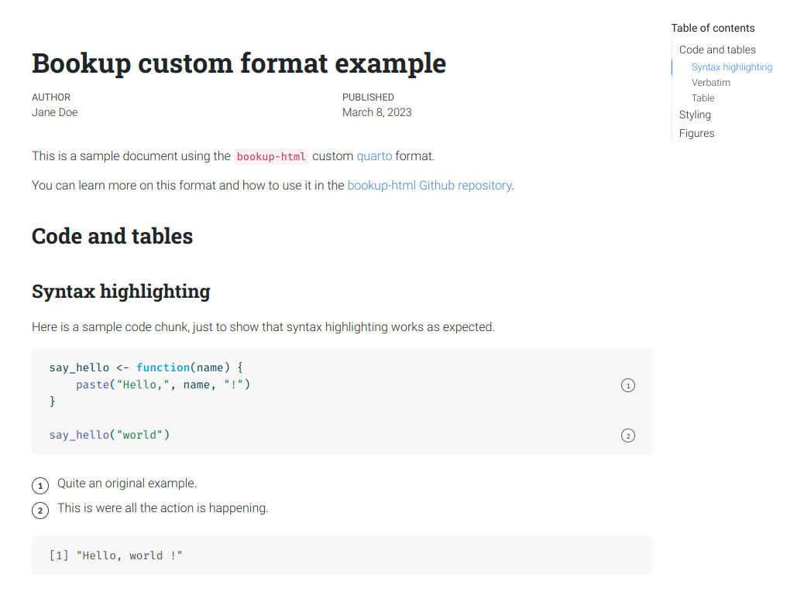
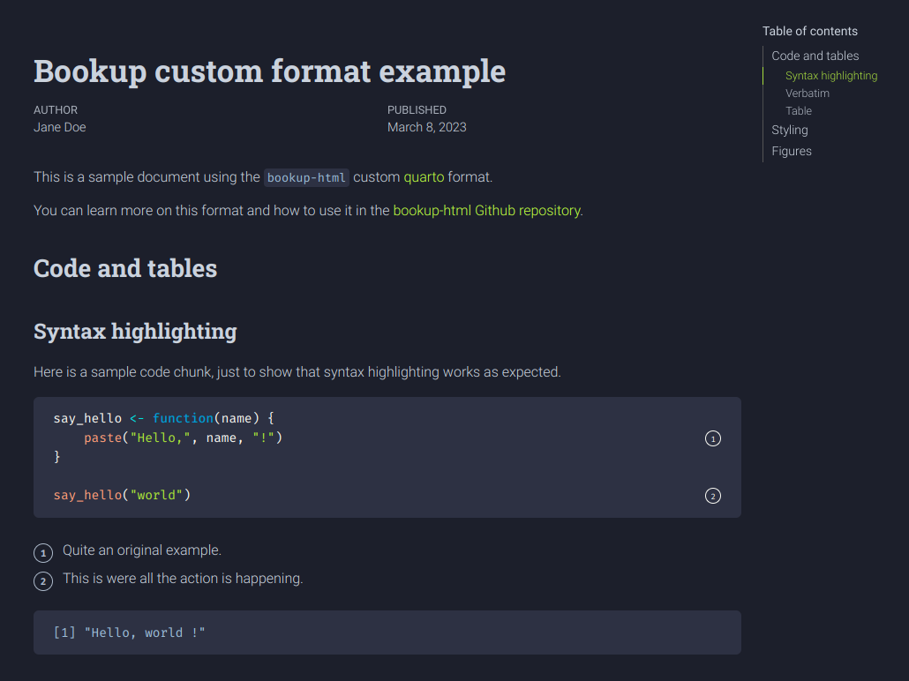
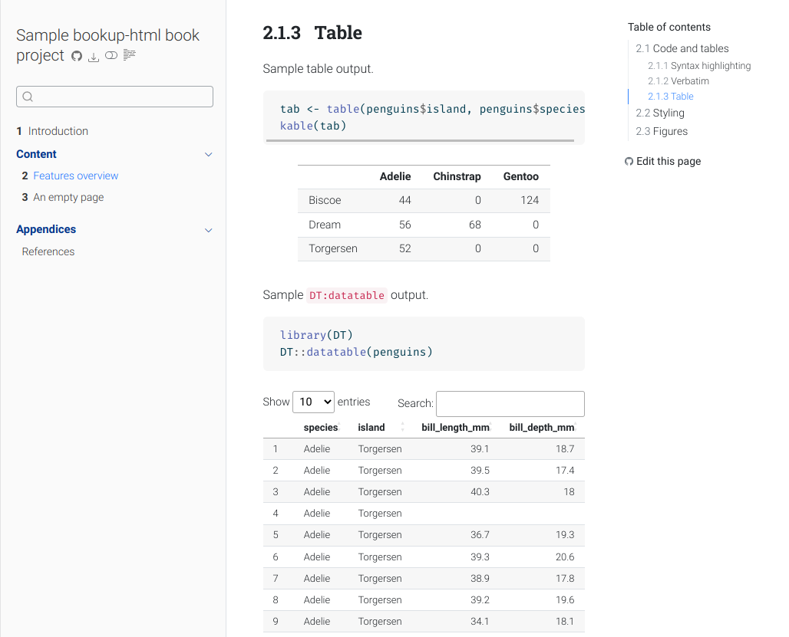
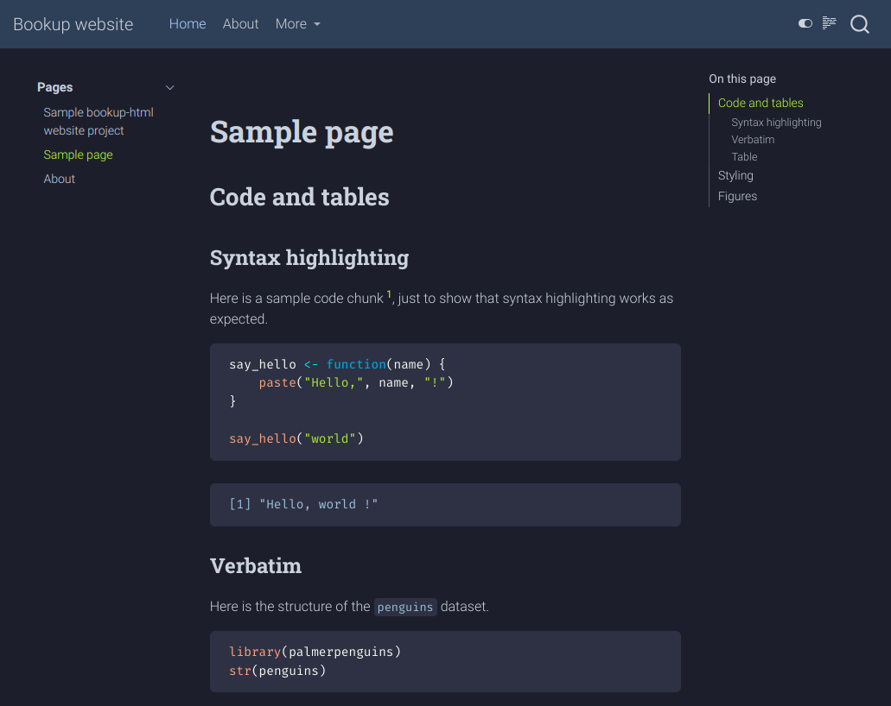

# bookup-html custom quarto format

[](https://github.com/juba/bookup-html/actions/workflows/publish.yml)


`bookup` is a custom [quarto](https://quarto.org) HTML format based on the Roboto font family. It provides both a light and a dark theme, and should be suitable for single documents, book projects and website projects.

## Screenshots

### Single document

Single document, light theme ([live example](https://juba.github.io/bookup-html/bookup.html)):

[](https://juba.github.io/bookup-html/bookup.html)

Single document, dark theme ([live example](https://juba.github.io/bookup-html/bookup.html)):

[](https://juba.github.io/bookup-html/bookup.html)

### Book project

Book project with a docked sidebar, light theme ([live example](https://juba.github.io/bookup-html/book/)):

[](https://juba.github.io/bookup-html/book/)


### Website project

Website project with a floating sidebar, dark theme ([live example](https://juba.github.io/bookup-html/website/)):

[](https://juba.github.io/bookup-html/website/)

## Installation and usage

To use this custom format, first install the extension at the root directory of your project:

```bash
quarto add juba/bookup-html
```

And add the format to your YAML configuration, along with other HTML format options if needed:

```yaml
format:
    bookup-html:
        toc: true
        toc-depth: 3
```


Even simpler, you can also directly install the extensions and generate a sample qmd file from a template with:

```bash
quarto use template juba/bookup-html
```


## Format Options


Currently `bookup` provides the following options:

- `embed-fonts` : if set to `true`, fonts are included locally with the document. If set to `false`, they are downloaded from Google Web Fonts. Not that if you use `self-contained: true`, fonts are embedded inside the resulting HTML even if `embed-fonts` is `false`.


## Credits

This format is derived from the original [bookdown](https://bookdown.org) theme, adapted for the online french book [Introduction à R et au tidyverse](https://juba.github.io/tidyverse).

